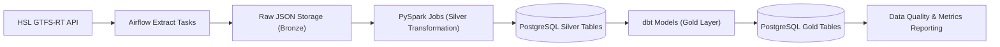

# HSL GTFS Realtime Production-Style Data Pipeline

This project is an end-to-end **production-style data engineering pipeline** built with **Apache Airflow**, **PySpark**, and **PostgreSQL** to process real-time public transportation data from **HSL (Helsinki Regional Transport Authority)**.

The goal of this project is not only to ingest and transform GTFS Realtime data, but to simulate how a real-world data platform operates — including:

- Idempotent data processing
- Backfill support
- Data validation checks
- Structured logging and observability
- Gold-layer analytical outputs

The pipeline runs fully locally using **Docker Compose**, without manual intervention.

---

## Project Goal

Build a reliable and reproducible data pipeline that ingests GTFS Realtime feeds and produces daily operational metrics about Helsinki public transport, including:

- Route delay statistics
- Vehicle activity per hour
- Data quality monitoring reports

---
## Project Overview

- **Data Source**: [HSL Open Data – GTFS Realtime](https://www.hsl.fi/en/open-data)
- **Feeds Used**:
  - Vehicle Positions
  - Trip Updates
- **Data Format**: GTFS Realtime (Protocol Buffers → JSON)
- **Processing Stack**: Apache Airflow, PySpark (local), PostgreSQL, dbt
- **Architecture Pattern**: Bronze → Silver → Gold layered design

This project simulates a real-world data engineering workflow by ingesting public transit event data, transforming it with Spark, modeling analytical outputs with dbt, and applying data validation and operational best practices such as idempotent processing and backfills.

---

## Architecture Overview


---

## Data Layers

### Bronze (Raw Layer)
* **Raw GTFS Realtime feeds** stored as JSON
* **Immutable** raw ingestion
* Supports **historical reprocessing**

### Silver (Cleaned Layer)
* Processed with **PySpark**
* Flattened nested **Protobuf** structures
* Deduplicated records
* Timestamp normalization
* Partition-aware loading
* Idempotent writes

**Tables:**
* `vehicle_positions_silver`
* `trip_updates_silver`

### Gold (Analytics Layer)
* Modeled using **dbt**

**Analytical outputs:**
* `gold_route_delay_daily`
* `gold_vehicle_activity_hourly`
* `gold_data_quality_issues_daily`

---

## Production Features

### Idempotency
The pipeline supports **safe reprocessing** of specific execution dates without creating duplicate records.

### Backfills
**Airflow** supports date-based backfills via DAG parameters.

### Data Quality
Validation checks include:
* **Not-null** critical fields
* **Coordinate range** validation
* **Duplicate detection**
* **Record count** monitoring

**Quality results are stored in:**
* `gold_data_quality_issues_daily`

### Observability
* **Structured logging**
* **Row count tracking** per stage
* **Execution duration** tracking
* **Retry strategy** in Airflow


---

## Project Overview

- **Data Source**: [HSL Open Data](https://www.hsl.fi/en/open-data)
- **Pipeline Tools**: Apache Airflow, PySpark, Databricks, Delta Lake
- **Format**: GTFS Realtime (Protocol Buffers → JSON)
- **Purpose**: Learn and practice real-world data engineering using public transit data

---

## Tech Stack

* **Apache Airflow** (orchestration)
* **PySpark** (data processing)
* **PostgreSQL** (analytical storage)
* **dbt** (data modeling & testing)
* **Docker & Docker Compose**
* **Python 3.10+**
* **gtfs-realtime-bindings**
* **Protobuf / JSON / REST APIs**

---

## Project Structure

```bash
hsl-gtfs-realtime-pipeline/
├── dags/                     # Airflow DAGs
├── src/                      # Extraction logic
├── spark_jobs/               # PySpark transformation scripts
├── dbt/                      # dbt project (gold models)
├── tests/                    # Unit tests
├── data/raw/                 # Bronze layer
├── docker/airflow/           # Airflow container setup
├── docker-compose.yaml
├── requirements.txt
└── Makefile
```
---

## Installation

Follow these steps to set up and run the project using Docker and Docker Compose. The `Makefile` is provided to streamline the process.

### 1. Prerequisites

Make sure you have the following installed:
- [Docker](https://docs.docker.com/get-docker/)
- [Docker Compose](https://docs.docker.com/compose/install/)
- [Make](https://www.gnu.org/software/make/)

### 2. Clone the Repository

First, clone the repository to your local machine:

```bash
git clone https://github.com/jestebanpelaez18/hsl-gtfs-realtime-pipeline.git
cd hsl-gtfs-realtime-pipeline
```

### 3. Build and Start the Project

Use the Makefile to handle the setup, build, and start processes. Run:

```bash
make
```
This command will:
- Build and start the Docker containers defined in docker-compose.yml: Airflow,PostgreSQL, Spark Enviroment
- Build and start Airflow
`
### 4. Visit Airflow UI

* URL: [http://localhost:8080](http://localhost:8080)
* Default login: `admin / admin`

### 5. Trigger the DAG

Manually in the UI or run:
```bash
make trigger
```

### The pipeline will:

1. **Extract** GTFS feeds
2. **Store** raw JSON (Bronze)
3. **Run** PySpark transformations (Silver)
4. **Load** results into PostgreSQL
5. **Execute** dbt models (Gold)
6. **Run** data quality checks

### Example Analytical Query

```sql
-- Top 10 routes with highest average delay yesterday
SELECT route_id, AVG(delay_seconds) AS avg_delay
FROM gold_route_delay_daily
WHERE event_date = CURRENT_DATE - INTERVAL '1 day'
GROUP BY route_id
ORDER BY avg_delay DESC
LIMIT 10;
```

---

## Future Improvements

* **Cloud storage** integration (Azure Blob)
* **Incremental** dbt models
* **Real-time** ingestion simulation
* **ML training pipeline** on delay prediction
* **Dashboard integration** (Metabase / Superset)

---

## Learning Objectives

This project demonstrates practical knowledge in:

* **End-to-end** data pipeline design
* **Spark-based** transformations
* **Data modeling** best practices
* **Production reliability** concepts
* **Operational data** workflows
* **Reprocessing** and backfill strategies