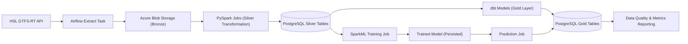
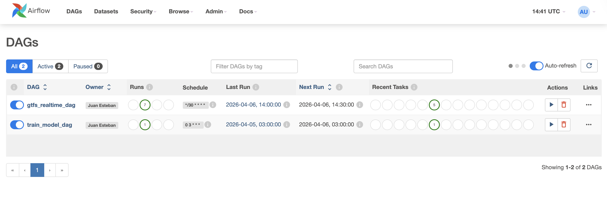
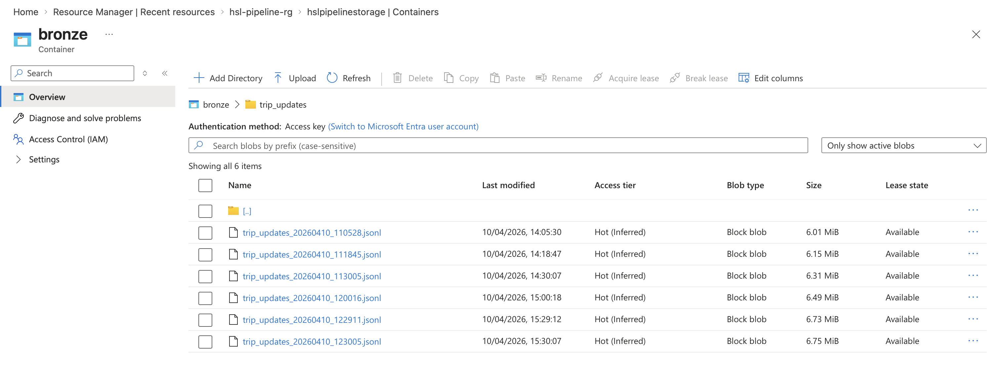
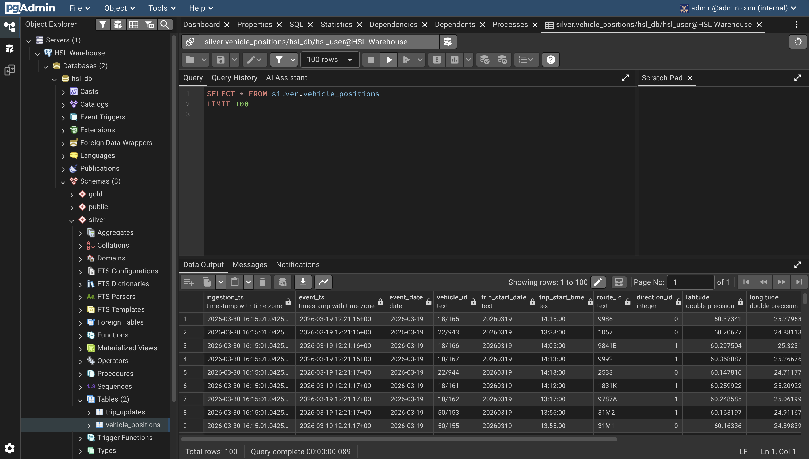
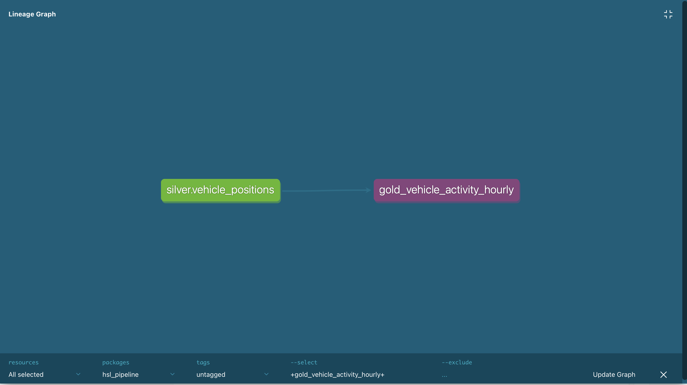

# HSL GTFS Realtime Production-Style Data Pipeline

## What is this?

This project automatically collects real-time data from Helsinki's public transport network, processes it, and produces daily reports 
on route performance, vehicle activity, and service reliability. It also predicts which bus stops are likely to be skipped based on 
historical patterns.

--

This project is an end-to-end **production-style data engineering pipeline** built with **Apache Airflow**, **PySpark**, **dbt**, and **PostgreSQL** to process real-time public transportation data from **HSL (Helsinki Regional Transport Authority)**.

The goal of this project is not only to ingest and transform GTFS Realtime data, but to simulate how a real-world data platform operates — including:

- Idempotent data processing
- Backfill support
- Data validation checks
- Structured logging and observability
- Gold-layer analytical outputs

The pipeline runs on **Docker Compose** with the Bronze layer stored in **Azure Blob Storage**, without manual intervention.

---

## Project Goal

Build a reliable and reproducible data pipeline that ingests GTFS Realtime feeds and produces daily operational metrics about Helsinki public transport, including:

- Route activity statistics
- Vehicle activity per hour
- Data quality monitoring reports

---

## Project Overview

- **Data Source**: [HSL Open Data – GTFS Realtime](https://www.hsl.fi/en/open-data)
- **Feeds Used**:
  - Vehicle Positions
  - Trip Updates
- **Data Format**: GTFS Realtime (Protocol Buffers → JSON)
- **Processing Stack**: Apache Airflow, PySpark, PostgreSQL, dbt, Azure Blob Storage
- **Architecture Pattern**: Bronze → Silver → Gold layered design

This project simulates a real-world data engineering workflow by ingesting public transit event data, transforming it with Spark, modeling analytical outputs with dbt, and applying data validation and operational best practices such as idempotent processing and backfills.

---

## Architecture Overview



---

## Pipeline in Action

### Airflow — Two Orchestrated Pipelines



### Airflow Graph View


### Azure Blob Storage — Bronze Layer in the Cloud



### dbt Run — Gold Layer Models


### pgAdmin — Data Warehouse Explorer



### dbt Docs — Model Lineage Graph



---

## Data Layers

### Bronze (Raw Layer)
* **Raw GTFS Realtime feeds** stored as JSONL files in **Azure Blob Storage**
* **Immutable** raw ingestion
* Supports **historical reprocessing**
* Falls back to local storage if Azure credentials are not configured

### Silver (Cleaned Layer)
* Processed with **PySpark**
* Flattened nested **Protobuf** structures
* Timestamp normalization
* Idempotent writes (delete-then-insert by date)

**Tables:**
* `silver.vehicle_positions`
* `silver.trip_updates`

### Gold (Analytics Layer)
* Modeled using **dbt**
* Tested with dbt schema tests

**Analytical outputs:**
* `gold.gold_route_delay_daily` — daily operational activity per route
* `gold.gold_vehicle_activity_hourly` — vehicle activity aggregated by hour
* `gold.gold_data_quality_issues_daily` — daily data quality monitoring report

### ML Layer
* Built with **SparkML**
* Trained on historical `silver.trip_updates` data

**ML outputs:**
* `gold.ml_model_results` — model training metrics (AUC, train/test size)
* `gold.skipped_stops_predictions` — predicted skipped stops with probability scores

---

## Production Features

### Cloud Storage
Raw GTFS Realtime feeds are stored in **Azure Blob Storage** (`wasbs://bronze@hslpipelinestorage`). PySpark jobs read directly from Azure Blob using the `hadoop-azure` connector. The pipeline automatically falls back to local storage if Azure credentials are not configured, making it portable for local development.

### Idempotency
The pipeline supports **safe reprocessing** of specific execution dates without creating duplicate records. Before each load, existing records for that date are deleted and replaced with fresh data.

### Backfills
**Airflow** supports date-based backfills via DAG parameters.

### Data Quality
Validation checks include:
* **Not-null** critical fields
* **Coordinate range** validation (bounding box of Helsinki)
* **Invalid speed** detection
* **Arrival/departure consistency** checks
* **Record count** monitoring per day

Quality results are stored in `gold.gold_data_quality_issues_daily` and tested via dbt schema tests.

### Observability
* **Structured logging** via Airflow task logs
* **Row count tracking** per stage
* **Retry strategy** configured in Airflow default args

### Scheduling
Two Airflow DAGs run on independent schedules:
* **`gtfs_realtime_dag`** — runs every 30 minutes, ingesting fresh data and updating predictions
* **`train_model_dag`** — runs daily at 3am, retraining the SparkML model with accumulated data

### Data Exploration
* **pgAdmin** available at `http://localhost:5050` for visual database exploration
* **dbt docs** available at `http://localhost:8081` for interactive model documentation and lineage graph

### ML Pipeline
A **SparkML classification model** trained on historical trip data predicts which bus stops are likely to be skipped:
* **Algorithm**: Random Forest Classifier (50 trees, max depth 5)
* **Features**: route, direction, hour of day, day of week
* **Target**: whether a stop will be skipped (`SKIPPED` vs normal)
* **Result**: AUC of 0.92 on held-out test set
* **Model persistence**: trained model saved to disk and reloaded for predictions without retraining

---

## Tech Stack

* **Apache Airflow 2.5.1** (orchestration)
* **PySpark 3.5.1** (data processing)
* **SparkML** (machine learning)
* **PostgreSQL 16** (analytical storage)
* **dbt-postgres 1.8.0** (data modeling & testing)
* **Azure Blob Storage** (Bronze layer cloud storage)
* **Docker & Docker Compose** (containerized environment)
* **Python 3.7+**
* **gtfs-realtime-bindings** (Protobuf parsing)

---

## Project Structure

```bash
hsl-gtfs-realtime-pipeline/
├── dags/                     # Airflow DAGs
├── src/                      # Extraction logic (HSL API)
├── spark_jobs/               # PySpark transformation scripts
│   ├── 02_vehicle_positions_silver.py
│   ├── 03_trip_updates_silver.py
│   ├── 04_train_delay_model.py
│   └── 05_predict_skipped_stops.py
├── models/                   # Persisted SparkML models (gitignored)
├── dbt/                      # dbt project (gold models & tests)
│   ├── models/
│   │   ├── gold/             # Gold layer SQL models
│   │   └── sources.yml       # Silver source definitions
│   ├── macros/               # Custom dbt macros
│   ├── profiles.yml          # dbt connection config
│   └── dbt_project.yml       # dbt project config
├── sql/                      # Database initialization scripts
├── docker/
│   ├── airflow/              # Airflow Dockerfile & entrypoint
│   ├── dbt/                  # dbt Dockerfile & start script
│   ├── spark/                # Spark Dockerfile
│   └── pgadmin/              # pgAdmin server config
├── docs/
│   └── images/               # Screenshots for README
├── data/raw/                 # Bronze layer (gitignored)
├── jars/                     # PostgreSQL JDBC driver
├── docker-compose.yaml
├── requirements.txt
└── Makefile
```

---

## Installation

### 1. Prerequisites

Make sure you have the following installed:
- [Docker](https://docs.docker.com/get-docker/)
- [Docker Compose](https://docs.docker.com/compose/install/)
- [Make](https://www.gnu.org/software/make/)

### 2. Clone the Repository

```bash
git clone https://github.com/jestebanpelaez18/hsl-gtfs-realtime-pipeline.git
cd hsl-gtfs-realtime-pipeline
```

### 3. Configure Environment Variables

Copy the example env file and fill in your credentials:

```bash
cp .env.example .env
```

Required variables:
```
WAREHOUSE_POSTGRES_USER=hsl_user
WAREHOUSE_POSTGRES_PASSWORD=hsl_pass
WAREHOUSE_POSTGRES_DB=hsl_db
AZURE_STORAGE_CONNECTION_STRING=your_connection_string
AZURE_STORAGE_ACCOUNT_NAME=your_account_name
AZURE_STORAGE_ACCOUNT_KEY=your_account_key
```

If Azure credentials are not set, the pipeline will fall back to local storage automatically.

### 3. Build and Start the Project

```bash
make
```

This command will build and start all Docker containers:
- `airflow-webserver` & `airflow-scheduler`
- `airflow-postgres` (Airflow metadata DB)
- `warehouse-postgres` (data warehouse)
- `spark` (PySpark processing)
- `dbt` (Gold layer modeling + docs server)
- `pgadmin` (database explorer)

### 4. Access the Services

| Service | URL | Credentials |
|---|---|---|
| Airflow UI | http://localhost:8080 | admin / admin |
| pgAdmin | http://localhost:5050 | admin@admin.com / admin |
| dbt docs | http://localhost:8081 | - |

On first login to pgAdmin, enter the warehouse password `hsl_pass` when prompted.

### 5. Trigger the Pipeline

Manually in the UI or run:

```bash
make trigger
```

The pipeline will execute in this order:

1. **Extract** GTFS Realtime feeds from HSL API
2. **Store** raw JSON files (Bronze layer)
3. **Transform** with PySpark → Silver tables
4. **Model** with dbt → Gold tables
5. **Validate** data quality checks
6. **Predict** skipped stops using the trained SparkML model

To train or retrain the ML model manually:

```bash
make spark-train
```

---

## Makefile Commands

| Command | Description |
|---|---|
| `make` | Build and start all containers |
| `make up` | Start containers without rebuilding |
| `make down` | Stop containers |
| `make trigger` | Trigger the Airflow DAG manually |
| `make spark-vehicle` | Run vehicle positions Spark job manually |
| `make spark-trip` | Run trip updates Spark job manually |
| `make spark-train` | Train the SparkML delay prediction model |
| `make spark-predict` | Run skipped stops prediction job |
| `make dbt-run` | Run dbt gold models manually |
| `make dbt-test` | Run dbt data quality tests |
| `make dbt-docs` | Generate and serve dbt documentation |
| `make check-vehicle` | Check silver.vehicle_positions row count |
| `make check-trip` | Check silver.trip_updates row count |
| `make clean` | Stop and remove containers and volumes |

---

## Example Analytical Queries

```sql
-- Top 10 most active routes today
SELECT route_id, SUM(total_stop_updates) AS total_updates
FROM gold.gold_route_delay_daily
WHERE event_date = CURRENT_DATE
GROUP BY route_id
ORDER BY total_updates DESC
LIMIT 10;

-- Vehicle activity by hour for a specific route
SELECT hour_of_day, active_vehicles, avg_speed_ms * 3.6 AS avg_speed_kmh
FROM gold.gold_vehicle_activity_hourly
WHERE route_id = '1001'
  AND event_date = CURRENT_DATE
ORDER BY hour_of_day;

-- Data quality summary
SELECT event_date, vp_invalid_coordinates, tu_arrival_after_departure
FROM gold.gold_data_quality_issues_daily
ORDER BY event_date DESC;

-- Top 10 stops most likely to be skipped
SELECT route_id, stop_id, hour_of_day, day_of_week, skip_probability
FROM gold.skipped_stops_predictions
ORDER BY skip_probability DESC
LIMIT 10;
```

---

## Future Improvements

* **Azure PostgreSQL** — migrate Silver/Gold warehouse to cloud
* **Incremental** dbt models
* **Real-time** ingestion simulation with Kafka
* **Dashboard integration** (Metabase / Superset)
* **Retrain pipeline** — automated model retraining as new data arrives

---

## Learning Objectives

This project demonstrates practical knowledge in:

* **End-to-end** data pipeline design
* **Spark-based** transformations on nested JSON/Protobuf data
* **Data modeling** with dbt (Bronze → Silver → Gold)
* **Production reliability** concepts (idempotency, retries, backfills)
* **Containerized** data engineering environments
* **Data quality** monitoring and validation
* **Pipeline orchestration** with Apache Airflow
* **Machine learning** with SparkML (classification, feature engineering, model persistence)
* **Cloud storage** integration with Azure Blob Storage
