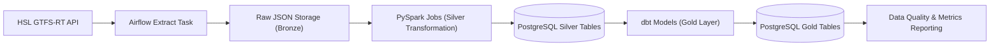
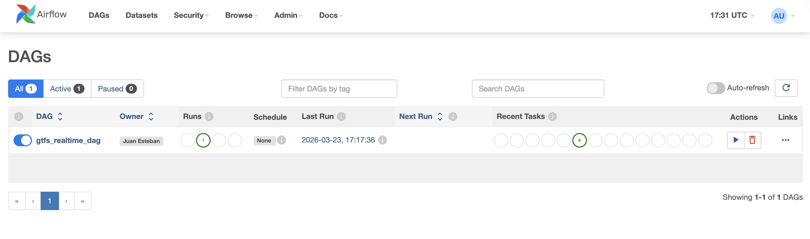
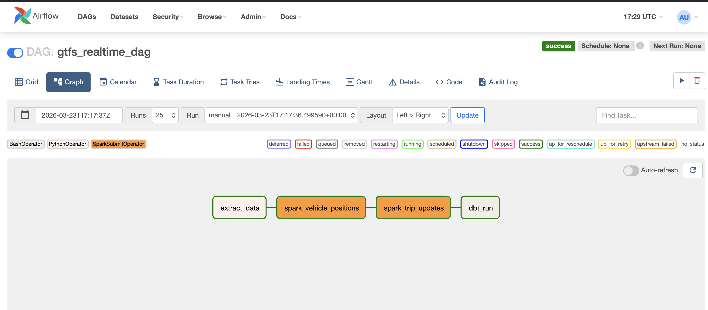
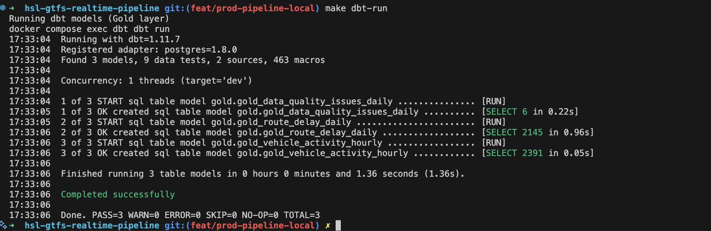

# HSL GTFS Realtime Production-Style Data Pipeline

This project is an end-to-end **production-style data engineering pipeline** built with **Apache Airflow**, **PySpark**, **dbt**, and **PostgreSQL** to process real-time public transportation data from **HSL (Helsinki Regional Transport Authority)**.

The goal of this project is not only to ingest and transform GTFS Realtime data, but to simulate how a real-world data platform operates — including:

- Idempotent data processing
- Backfill support
- Data validation checks
- Structured logging and observability
- Gold-layer analytical outputs

The pipeline runs fully locally using **Docker Compose**, without manual intervention.

---

## Project Goal

Build a reliable and reproducible data pipeline that ingests GTFS Realtime feeds and produces daily operational metrics about Helsinki public transport, including:

- Route activity statistics
- Vehicle activity per hour
- Data quality monitoring reports

---

## Project Overview

- **Data Source**: [HSL Open Data – GTFS Realtime](https://www.hsl.fi/en/open-data)
- **Feeds Used**:
  - Vehicle Positions
  - Trip Updates
- **Data Format**: GTFS Realtime (Protocol Buffers → JSON)
- **Processing Stack**: Apache Airflow, PySpark, PostgreSQL, dbt
- **Architecture Pattern**: Bronze → Silver → Gold layered design

This project simulates a real-world data engineering workflow by ingesting public transit event data, transforming it with Spark, modeling analytical outputs with dbt, and applying data validation and operational best practices such as idempotent processing and backfills.

---

## Architecture Overview



---

## Pipeline in Action

### Airflow DAG — Full Pipeline Orchestration



### Airflow Graph View



### dbt Run — Gold Layer Models



---

## Data Layers

### Bronze (Raw Layer)
* **Raw GTFS Realtime feeds** stored as JSONL files
* **Immutable** raw ingestion
* Supports **historical reprocessing**

### Silver (Cleaned Layer)
* Processed with **PySpark**
* Flattened nested **Protobuf** structures
* Timestamp normalization
* Idempotent writes (delete-then-insert by date)

**Tables:**
* `silver.vehicle_positions`
* `silver.trip_updates`

### Gold (Analytics Layer)
* Modeled using **dbt**
* Tested with dbt schema tests

**Analytical outputs:**
* `gold.gold_route_delay_daily` — daily operational activity per route
* `gold.gold_vehicle_activity_hourly` — vehicle activity aggregated by hour
* `gold.gold_data_quality_issues_daily` — daily data quality monitoring report

---

## Production Features

### Idempotency
The pipeline supports **safe reprocessing** of specific execution dates without creating duplicate records. Before each load, existing records for that date are deleted and replaced with fresh data.

### Backfills
**Airflow** supports date-based backfills via DAG parameters.

### Data Quality
Validation checks include:
* **Not-null** critical fields
* **Coordinate range** validation (bounding box of Helsinki)
* **Invalid speed** detection
* **Arrival/departure consistency** checks
* **Record count** monitoring per day

Quality results are stored in `gold.gold_data_quality_issues_daily` and tested via dbt schema tests.

### Observability
* **Structured logging** via Airflow task logs
* **Row count tracking** per stage
* **Retry strategy** configured in Airflow default args

---

## Tech Stack

* **Apache Airflow 2.5.1** (orchestration)
* **PySpark 3.5.1** (data processing)
* **PostgreSQL 16** (analytical storage)
* **dbt-postgres 1.8.0** (data modeling & testing)
* **Docker & Docker Compose** (containerized environment)
* **Python 3.7+**
* **gtfs-realtime-bindings** (Protobuf parsing)

---

## Project Structure

```bash
hsl-gtfs-realtime-pipeline/
├── dags/                     # Airflow DAGs
├── src/                      # Extraction logic (HSL API)
├── spark_jobs/               # PySpark transformation scripts
├── dbt/                      # dbt project (gold models & tests)
│   ├── models/
│   │   ├── gold/             # Gold layer SQL models
│   │   └── sources.yml       # Silver source definitions
│   ├── macros/               # Custom dbt macros
│   ├── profiles.yml          # dbt connection config
│   └── dbt_project.yml       # dbt project config
├── sql/                      # Database initialization scripts
├── docker/
│   ├── airflow/              # Airflow Dockerfile & entrypoint
│   ├── dbt/                  # dbt Dockerfile
│   └── spark/                # Spark Dockerfile
├── docs/
│   └── images/               # Screenshots for README
├── data/raw/                 # Bronze layer (gitignored)
├── jars/                     # PostgreSQL JDBC driver
├── docker-compose.yaml
├── requirements.txt
└── Makefile
```

---

## Installation

### 1. Prerequisites

Make sure you have the following installed:
- [Docker](https://docs.docker.com/get-docker/)
- [Docker Compose](https://docs.docker.com/compose/install/)
- [Make](https://www.gnu.org/software/make/)

### 2. Clone the Repository

```bash
git clone https://github.com/jestebanpelaez18/hsl-gtfs-realtime-pipeline.git
cd hsl-gtfs-realtime-pipeline
```

### 3. Build and Start the Project

```bash
make
```

This command will build and start all Docker containers:
- `airflow-webserver` & `airflow-scheduler`
- `airflow-postgres` (Airflow metadata DB)
- `warehouse-postgres` (data warehouse)
- `spark` (PySpark processing)
- `dbt` (Gold layer modeling)

### 4. Visit Airflow UI

* URL: [http://localhost:8080](http://localhost:8080)
* Default login: `admin / admin`

### 5. Trigger the Pipeline

Manually in the UI or run:

```bash
make trigger
```

The pipeline will execute in this order:

1. **Extract** GTFS Realtime feeds from HSL API
2. **Store** raw JSON files (Bronze layer)
3. **Transform** with PySpark → Silver tables
4. **Model** with dbt → Gold tables
5. **Validate** data quality checks

---

## Makefile Commands

| Command | Description |
|---|---|
| `make` | Build and start all containers |
| `make trigger` | Trigger the Airflow DAG |
| `make spark-vehicle` | Run vehicle positions Spark job manually |
| `make spark-trip` | Run trip updates Spark job manually |
| `make dbt-run` | Run dbt gold models manually |
| `make dbt-test` | Run dbt data quality tests |
| `make check-vehicle` | Check silver.vehicle_positions row count |
| `make check-trip` | Check silver.trip_updates row count |
| `make clean` | Stop and remove containers and volumes |

---

## Example Analytical Queries

```sql
-- Top 10 most active routes today
SELECT route_id, SUM(total_stop_updates) AS total_updates
FROM gold.gold_route_delay_daily
WHERE event_date = CURRENT_DATE
GROUP BY route_id
ORDER BY total_updates DESC
LIMIT 10;

-- Vehicle activity by hour for a specific route
SELECT hour_of_day, active_vehicles, avg_speed_ms * 3.6 AS avg_speed_kmh
FROM gold.gold_vehicle_activity_hourly
WHERE route_id = '1001'
  AND event_date = CURRENT_DATE
ORDER BY hour_of_day;

-- Data quality summary
SELECT event_date, vp_invalid_coordinates, tu_arrival_after_departure
FROM gold.gold_data_quality_issues_daily
ORDER BY event_date DESC;
```

---

## Future Improvements

* **pgAdmin** integration for visual database exploration
* **dbt docs** for interactive model documentation and lineage graph
* **Scheduled** DAG runs (e.g. every 30 minutes)
* **Cloud storage** integration (Azure Blob / S3)
* **Incremental** dbt models
* **ML training pipeline** on delay prediction
* **Dashboard integration** (Metabase / Superset)

---

## Learning Objectives

This project demonstrates practical knowledge in:

* **End-to-end** data pipeline design
* **Spark-based** transformations on nested JSON/Protobuf data
* **Data modeling** with dbt (Bronze → Silver → Gold)
* **Production reliability** concepts (idempotency, retries, backfills)
* **Containerized** data engineering environments
* **Data quality** monitoring and validation
* **Pipeline orchestration** with Apache Airflow